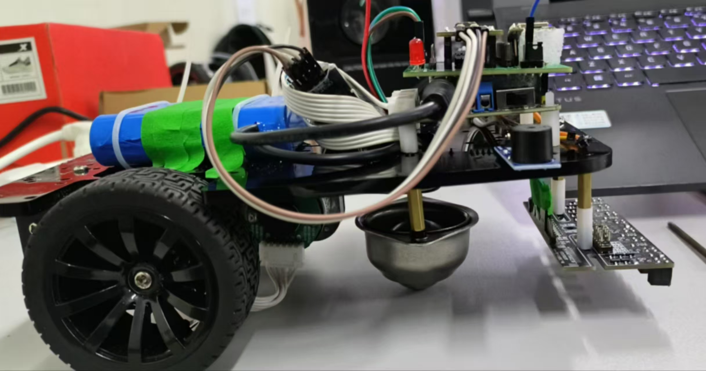
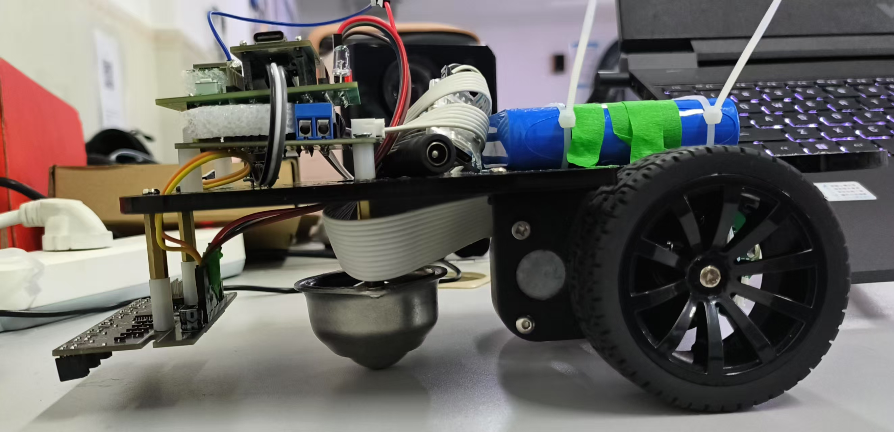
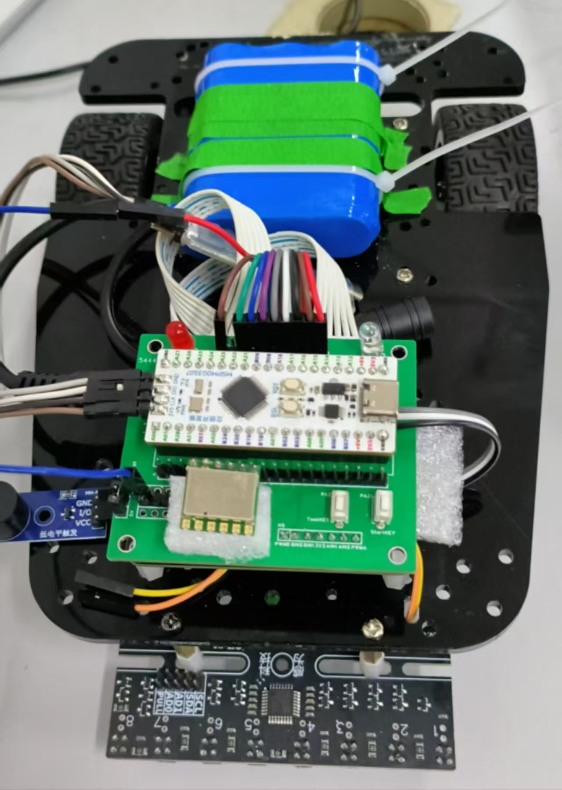
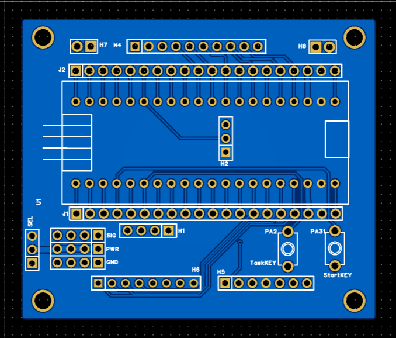

# 2024电子设计大赛H题智能小车
## 校赛完赛，实测第4问寄录35秒

## [PCB开源地址](https://u.lceda.cn/account/user/projects/index/members?project=a21ed0727ad447719ecbd93959d565b7&folder=all)
## [B站测评视频](https://www.bilibili.com/video/BV1xQNzzUEWS/?spm_id_from=333.1387.homepage.video_card.click)
## 电子模块（总价370块）

- [立创地猛星MSPM0G3507主控板（电赛优惠价30块)](https://item.szlcsc.com/24478333.html?lcsc_vid=T1FaUVcAFQVXUVJUFAAPBFxTFVUKVAJQRgdXVwBRQVQxVlNSTlJXU1xSTldYUjsOAxUeFF5JWBYZEEoEHg8JSQcJGk4%3D)
- [R3X系列三轮小车车模 106](https://item.taobao.com/item.htm?abbucket=6&detail_redpacket_pop=true&id=594481149003&mi_id=pjm_3wdTOvIPm7CIgRB8acNJtRmhUg0QKlvNVEXEoqaUKQQcYXTunwaisg57dwZ8TJxVVdM_qmXcacvM4wDxoBFK3fBJSjP0Tssh-nWKQx4&ns=1&priceTId=213e072c17493950995278926e10a3&query=R3X%E7%B3%BB%E5%88%97&skuId=5067668637755&spm=0.0.hoverItem.1&utparam=%7B%22aplus_abtest%22%3A%22ec5ee9e66e9d947a27c2d559ba93f412%22%7D&xxc=taobaoSearch)
- [MG513电机、13线霍尔编码器](https://item.taobao.com/item.htm?abbucket=6&detail_redpacket_pop=true&id=594481149003&mi_id=pjm_3wdTOvIPm7CIgRB8acNJtRmhUg0QKlvNVEXEoqaUKQQcYXTunwaisg57dwZ8TJxVVdM_qmXcacvM4wDxoBFK3fBJSjP0Tssh-nWKQx4&ns=1&priceTId=213e072c17493950995278926e10a3&query=R3X%E7%B3%BB%E5%88%97&skuId=5067668637755&spm=0.0.hoverItem.1&utparam=%7B%22aplus_abtest%22%3A%22ec5ee9e66e9d947a27c2d559ba93f412%22%7D&xxc=taobaoSearch)
- [塔克创新Tb6612电机驱动模块(带稳压) 32](https://detail.tmall.com/item.htm?abbucket=6&detail_redpacket_pop=true&id=838447196772&mi_id=siKALv5wjie-yYUBE-IVqV-UB3oQwq3xOE8aac6D70byqCH5ItorhEekR0iCcAph1wotNwf34ZagCBznm7LR8NNRLM12lvQadeMVY_sf1jk&ns=1&priceTId=214783e817493949527707361e1a20&query=tb6612&skuId=5768034939590&spm=0.0.hoverItem.5&utparam=%7B%22aplus_abtest%22%3A%22e8403ea3594e59933b3f71dfc730708a%22%7D&xxc=taobaoSearch)
- [CY-25A不锈钢牛眼轮 3](https://detail.tmall.com/item.htm?detail_redpacket_pop=true&id=920100840332&mi_id=epwPtrxkVMrelcqHujFt0e9XD4ITbxtjdmLWq_L19isYbIlpDIRHuKB86I6f-aw_n_TMV77humU2An5SDXYHnDHI1QfqQ9wywXWdhUWY-QM&ns=1&priceTId=213e04e317493951707026702e1b5c&query=CY-25A%E7%89%9B%E7%9C%BC%E8%BD%AE&skuId=5956436590665&spm=0.0.hoverItem.1&utparam=%7B%22aplus_abtest%22%3A%22fb0e66b1318b2df87158299a8cdeae64%22%7D&xxc=ad_ztc)
- [5mmLED灯 2](https://item.taobao.com/item.htm?priceTId=213e074c17493952331733256e1868&utparam=%7B%22aplus_abtest%22%3A%2263bc95f97487b421d21e3e1978b63be0%22%7D&id=674866929367&ns=1&abbucket=6&xxc=taobaoSearch&detail_redpacket_pop=true&query=LED&mi_id=nMsTCZnDuKts4aI2Jfjcs4ZvLa-3uj5vLtexTfsLyTvx094uGp2_J9Nx0tSSxsNFiFhrQ2HRyoHkfxFub8RUt1Lfji8ul0-j3LmxzOz0klY&skuId=5029993387531&spm=0.0.hoverItem.3)
- [按键 2](https://item.taobao.com/item.htm?abbucket=6&detail_redpacket_pop=true&id=45677272349&mi_id=8YeMF2cxCvCryAGyCOxwqNjs6MPl1y6sr5S8RBybHpdLmuZjPBXIalJ7QOGkvcpRV--W9cRKMob5E8ToT3Vd8Cu6EWLEbCBUmGUDw_3Pmfw&ns=1&priceTId=213e074c17493954752601732e1868&query=%E6%8C%89%E9%94%AE&skuId=5111169289732&spm=0.0.hoverItem.2&utparam=%7B%22aplus_abtest%22%3A%22ed48affb0907688d013cd84d8e9a021c%22%7D&xxc=taobaoSearch)
- [有源蜂鸣器(低电平触发) 3](https://detail.tmall.com/item.htm?abbucket=6&detail_redpacket_pop=true&id=656159590251&mi_id=8Zq8mLmWJimuoc6RV53ezAIcBCsXfM5zNCMf1qzxTUBuuuLpt751MK60wpK3RcXiDsjiMrkIBFPtLyaaJ8Yj6-xh9YwiDTAXNeFDxUzouR0&ns=1&priceTId=213e074c17493955656236350e1868&query=%E6%9C%89%E6%BA%90%E8%9C%82%E9%B8%A3%E5%99%A8&skuId=5528205093524&spm=0.0.hoverItem.2&utparam=%7B%22aplus_abtest%22%3A%221c2c9d893101f833747e7d34cf88d8b5%22%7D&xxc=taobaoSearch)
- [JY901S陀螺仪 95](https://item.taobao.com/item.htm?abbucket=6&detail_redpacket_pop=true&id=634627673077&mi_id=4Kb87-z7TCx2-DuZBA56ROhXsyTLYCrWl6l3UglVKY-xE590neXJVL8gisLgBI8V0c3kANH6-0mKgDesihpaM75EdhCf3QxuAOlFRwjFuYA&ns=1&priceTId=213e044b17493956041348474e1ad6&query=jy901s&spm=0.0.hoverItem.2&utparam=%7B%22aplus_abtest%22%3A%226236e30c9cf4fa25a4801a56e6362764%22%7D&xxc=taobaoSearch)
- [8路灰度传感器 75](https://item.taobao.com/item.htm?priceTId=214781c017493956529718475e1276&utparam=%7B%22aplus_abtest%22%3A%22e86892cadfe917d1c232a5338da27738%22%7D&id=700000730878&ns=1&abbucket=6&xxc=taobaoSearch&detail_redpacket_pop=true&query=%E6%95%A2%E4%B8%BA%E7%A7%91%E6%8A%80%E7%81%B0%E5%BA%A6%E4%BC%A0%E6%84%9F%E5%99%A8&mi_id=p3He12ED41BoUwQOr7vR21XaLhReCuepgX4MajEkEOxjyq5xV9Y_moLfE82nuwRw_kPHd1LA84ykjoJCPls3oy6Z6cMh0HvyamA4lBNaC2I&skuId=5768776477755&spm=0.0.hoverItem.3)
- [12V锂电池 22](https://item.taobao.com/item.htm?id=562015429673)

## 任务点实现思路

### ■  任务1
- 将任务选择按键切换至“任务点1”，按下启动按键。
- 等待小车记录初始角度 angle_initial，此时标志位 Line_flag = 0。
- 记录完成后，小车以设定速度前进，并基于 JY901S 陀螺仪数据进行角度闭环控制，保持以初始角度直行。
- 同时启用灰度传感器检测黑线，一旦检测到黑线，执行刹停操作，并通过蜂鸣器与 LED 灯进行声光反馈。

### ■  任务2
- 将任务选择按键切换至“任务点2”，按下启动按键。

- 等待小车记录初始角度 angle_initial，此时标志位 Line_flag = 0。

- 记录完成后，小车以设定速度前进，并基于 JY901S 陀螺仪数据进行角度闭环控制，保持以初始角度直行。

- 同时启用灰度传感器检测黑线，一旦检测到黑线，设置标志位 Line_flag = 1，同时触发声光反馈。

- 当 Line_flag = 1 时，小车进入寻迹模式，使用灰度传感器结合 PID 控制实现巡线行驶。

- 寻迹完成后，将 Line_flag 设为 0，再次触发声光反馈，小车重新进入直行模式，继续基于陀螺仪的角度闭环控制。

- 再次检测到黑线后，执行声光反馈操作，将 Line_flag 设为 1，重复步骤 5~6 的寻迹流程。

### ■ 任务3
-  将任务选择按键切换至“任务点3”，按下启动按键。

- 等待小车记录初始角度 angle_initial，此时标志位 Line_flag = 0。

- 记录完成后，小车以 angle3(angle4) 为目标角度，在TimeLimit时限内原地右转，之后打开电机编码器，基于 JY901S 陀螺仪进行角度闭环控制，开始直行。

- 在直行过程中记录行驶里程，达到目标里程后，调整方向，以 8° (-5°) 为目标继续直行。同时启用灰度传感器检测黑线，一旦检测到黑线，设置标志位 Line_flag = 1，触发声光反馈。

- 当 Line_flag = 1 时，小车进入寻迹模式，使用灰度传感器结合 PID 控制实现巡线行驶。

- 寻迹完成后，将 Line_flag 设为 0，并再次触发声光反馈。

- 重复执行上述流程，实现循环运行。

### ■ 任务4
- 基于任务3的逻辑实现，提高电机给定速度。
- 执行完整的任务3流程共 4 次，每次均包含角度记录、直行、里程判断、黑线检测、寻迹等完整动作。