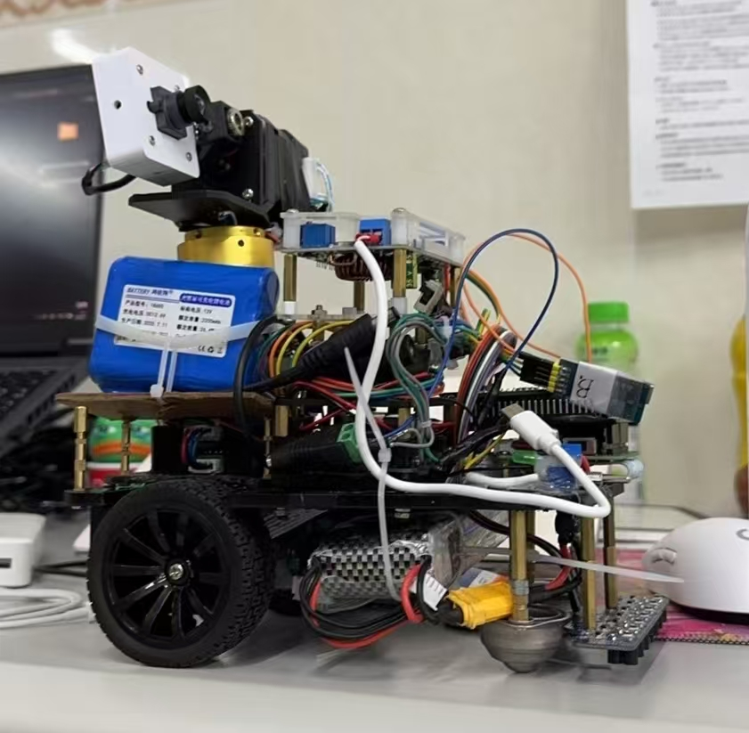
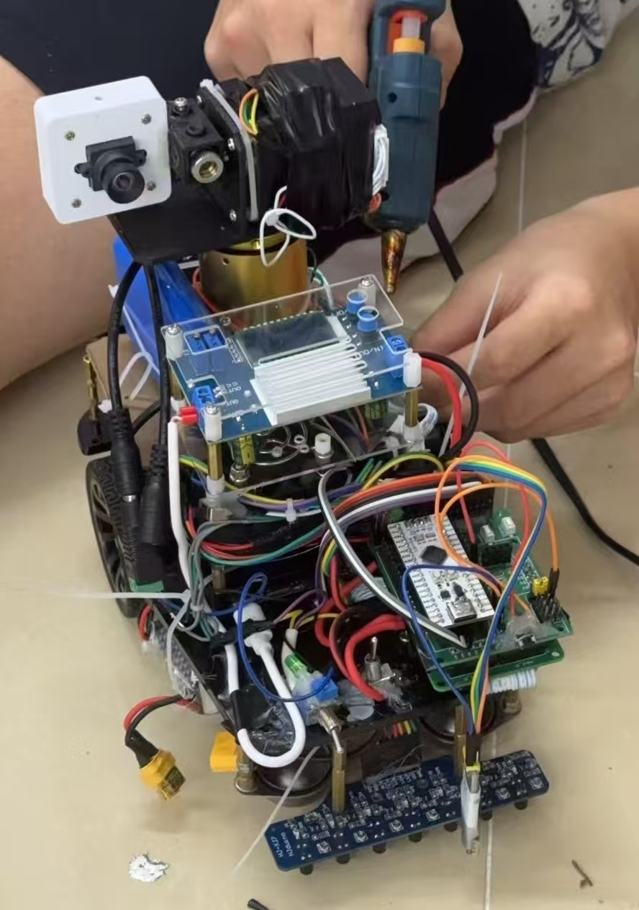

# 简易自行瞄准装置---25年电赛E题

[视频演示](https://www.bilibili.com/video/BV1xcSSBzECP)
[备赛过程](https://www.bilibili.com/video/BV1tDbWzqE1a)

## 战车靓照

## 运行环境
-  配置 keil + sysconfig 环境
- 将工程放置路径：./Ti/M0_SDK/mspm0_sdk_2_03_00_07

## 实现功能
- 3个按键，分别控制圈数、任务号、启动标志位
- 直黑线循迹、拐角利用速度环以及编码器估测转弯距离，参数调好可实现丝滑转弯
- 拐角检测：三路灰度检测到黑线连续多次，即认为检测到拐角，进入转弯阶段
- 任务区分
    - 任务1：4个拐角为1圈
    - 任务2：5个拐角为1圈 

## 赛题思路
MCU负责小车端，Linux负责串口控制云台、视觉处理
### 第1问：
整体使用寻迹环进行控制，当灰度传感器检测到拐角时，MCU切换成速度环差速转向同时使用编码器里程计数，减少转向误差；由于起始点自定，我们便设置找到4个拐角为1圈，并用按键设置圈数，最终实现小车行驶特定圈数的功能；

### 第2问/第3问：
由小电脑控制，MCU通过UART接收小电脑发送的云台的转动角度，进而控制云台转动。当目标未出现在相机视野时，MCU控制云台360度转动直到靶子出现在视野，再由小电脑进行图像处理，获取中心位置，最后控制云台转动至目标位置。

### 附加题思路同上

